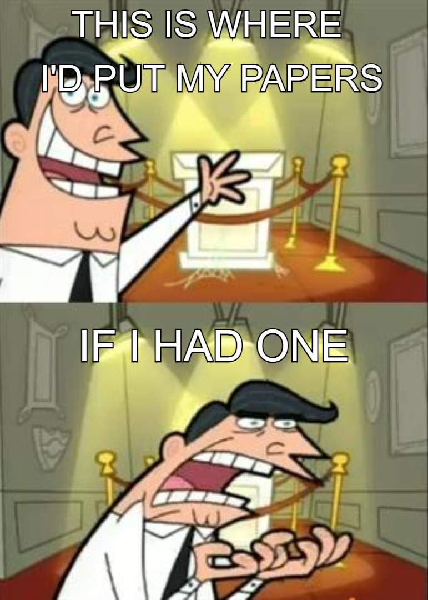

I am a PhD student of <a href="https://www.maths.ed.ac.uk/~cbarwick/" target="_blank">Clark Barwick</a> at the University of Edinburgh. I am interested in homotopy theory and infinity-categories, in particular infinity-operads and chromatic homotopy theory. I am an experienced user of the automatic mathematics assessment system <a href="https://stack-assessment.org/" target="_blank" rel="noopener noreferrer">STACK</a>. When I'm not thinking about mathematics, I may be swing dancing or bouldering.

<!--

<h1>Papers</h1>

-->

<h1>Notes</h1>

Informal notes on various topics. Comments and corrections are welcomed.
 
<!--<ul class="no-bullets">
<li>

<h3> Chromatic homotopy theory</h3>
<blockquote> (January 2023) Notes for <a href ="https://capnjackbevs.github.io/cht.html" target="_blank">a seminar series on chromatic homotopy theory</a> at the University of Edinburgh. Joint with <a href="https://capnjackbevs.github.io/" target="_blank" rel="noopener noreferrer">Willow Bevington</a>.</blockquote>
</li><li>

<h3> Spectral sequences</h3>
<blockquote> (January 2023) An evolving set of notes on spectral sequences, with focus on the Serre and Adams spectral sequences.</blockquote>
</li></ul>
<li>

<h3> Topological K-theory</h3>
<blockquote> (January 2023) Notes from a Winter 2023 eCHT graduate course on K-Theory. Joint with Adrián Doña Mateo and <a href="https://capnjackbevs.github.io/" target="_blank" rel="noopener noreferrer">Willow Bevington</a>.</blockquote>
</li>--><!--<li>

<h3> Spectral sequences</h3>
<blockquote> (January 2023) An evolving set of notes on spectral sequences, with focus on the Serre and Adams spectral sequences.</blockquote>
</li></ul>-->
<ul class="no-bullets">
<li>

<h3> (Co)ends: a taster</h3>
<blockquote> (August 2023) (Co)ends are an effective organisational tool in category theory, unifying many different concepts and providing a compact substitution to element-wise proofs. These notes are based on "Coend calculus" by Fosco Loregian. </blockquote>
</li>  
<li>

<h3> Persistent homology</h3>
<blockquote> (December 2022) Notes on persistent homology, as part of a GlaMS (Glasgow-Maxwell school) group project. Joint with <a href="https://yanyauc.com/" target="_blank" rel="noopener noreferrer">Yan Yau Cheng</a> and Adrián Doña Mateo.</blockquote>
</li>  
<li>

<h3> Axiomatic homology theory</h3>
<blockquote> (September 2021) Undergraduate notes on axiomatic homology theory. Homology is typically introduced as singular homology, with theorems proven explicitly using chain calculations. We take a different approach, defining a homology theory axiomatically as by Eilenberg and Steenrod, and then proving classical theorems directly from the axioms. This project was supervised by Prof. Clark Barwick and funded by the University of Edinburgh School of Mathematics Vacation Scholarship and College Vacation Scholarship funds.</blockquote>
</li>
</ul>

<h1>Talks</h1>

  <ul><li>

<b>(Co)ends in infinity-categories</b>. <a href = "https://hodge.maths.ed.ac.uk/?page_id=38" target="_blank" rel="noopener noreferrer">Hodge Club (Edinburgh)</a> (June 2024).
(Co)ends are certain (co)limits associated to bifunctors of the form F: C^op x C -> D. As an example, let R be a ring viewed as an one-object Ab-enriched category so an R-bimodule M is just a functor M:R^op x R -> Ab. Then the end of this functor is the centre of M and the coend is the space of coinvariants. (Co)ends are both abundant and admit a sort of calculus, making them useful for a large class of categorical arguments. In this talk I will give an overview of (co)ends, and explain how the definition can be extended to the world of infinity-categories.
</li>
      <li>

<b>∞-operads and operator categories</b>. <a href = "https://www.maths.ed.ac.uk/~adona/seminar.html" target="_blank" rel="noopener noreferrer">Edinburgh Category Theory Seminar</a> (March 2024).
Operads are combinatorial gadgets that control algebraic theories. They were first introduced by Boardman-Vogt and May to classify homotopy types of iterated loop spaces and have since become an invaluable tool for doing categorical algebra. Their ∞-categorical incarnation, ∞-operads, subsumes the classical notion and has been a major player in the recent renaissance of homotopy-coherent algebra. 
The theory of ∞-operads is controlled by the category of pointed finite sets. Naturally, one may ask which categories give rise to an "operad-like" theory. As an answer to this question, I will describe Barwick's notion of an operator category φ and its associaated theory of φ-operads. This is a natural generalization of ∞-operads, subsuming many known variants of the notion, for example non-symmetric operads.
</li>
      <li>

<b>Topological K-Theory</b>. <a href = "https://hodge.maths.ed.ac.uk/?page_id=38" target="_blank" rel="noopener noreferrer">Hodge Club (Edinburgh)</a> (February 2023).
Topological K-Theory is a generalized cohomology theory that captures information about vector bundles over a space. To build it, we first consider the Groethendieck group of C(X)-algebras, then extend this to a cohomology theory using suspensions. Alternatively, like any (co)homology theory, we can build a spectrum that represents it. The latter view illuminates the following important property of K-Theory: it controls the second cohomology theory in an infinite approximation of the stable homotopy groups of spheres.
</li>
  <li><b>The ultrafilter monad</b>. GLaMS Example showcase (November 2022).</li></ul>

<h1>Teaching</h1>

	<h3>Tutoring - University of Edinburgh</h3>
        <b>Autumn 2024</b>
            <ul>
        		<li>Accelerated Proofs and Problem Solving</li>
        		<li>Axiomatic Set Theory</li>
        		<li>MathsBase</li>
            </ul>
        <b>Spring 2024</b>
            <ul>
        		<li>Honour Algebra - Skills</li>
        		<li>Proofs and Problem Solving</li>
            </ul>
        <b>Autumn 2023</b>
            <ul>
                <li>Category Theory</li>
        		<li>Honours Analysis - Skills</li>
        		<li>MathsBase</li>
            </ul>
    	<b>Spring 2023</b>
            <ul>
            <li>Algebraic Topology</li>
        	<li>Fundamentals of Pure Mathematics</li>
            </ul>
<h3>Other</h3>
<ul>
    <li>In Autumn 2023 I mentored a project on algebraic topology for <a href="https://sites.google.com/view/twoples/home" target="_blank">Twoples</a>, an online directed reading program for maths undergraduates.</li>
</ul>

<h1>Reading groups</h1>

    <ul><li>(Spring 2024) <b><a href="https://malthefogsporring.github.io/infinity-n/">(∞,n)-categories</a></b> with <a href="https://capnjackbevs.github.io/" target="_blank">Willow Bevington</a>.</li>
      <li>(Summer 2023) <b>Coend calculus (Cofriends)</b> with <a href="https://capnjackbevs.github.io/" target="_blank">Willow Bevington</a> and Adrián Doña Mateo.</li>
  <li>(Spring 2023) <b><a href ="https://malthefogsporring.github.io/algebraic-geometry/">Algebraic geometry (Eisenboaties)</a></b> with <a href="https://capnjackbevs.github.io/" target="_blank">Willow Bevington</a>.</li>
      <li>(Spring 2023) <b><a href ="https://malthefogsporring.github.io/infinity-categories/">∞-categories</a></b> with <a href="https://capnjackbevs.github.io/" target="_blank">Willow Bevington</a> and Adrián Doña Mateo.</li>
  <li>(Spring 2023) <b><a href ="https://capnjackbevs.github.io/cht.html" target="_blank">Chromatic homotopy theory</a></b> with <a href="https://www.maths.ed.ac.uk/~cbarwick/" target="_blank">Clark Barwick</a> and <a href="https://capnjackbevs.github.io/" target="_blank">Willow Bevington</a>.</li>
      <li>(Fall 2022) <b>Commutative algebra (Eisenbuddies)</b>with <a href="https://capnjackbevs.github.io/" target="_blank">Willow Bevington</a>.</li></ul>

<!--

<h1>Travel</h1>

  <table><tr><td>July 2022</td> <td><b><a href = "https://www.math.ku.dk/english/calendar/events/ytm2022/" target="_blank">Young Topologists Meeting 2022</a></b></td><td>Copenhagen</td></tr>
  <tr><td>October 2022</td> <td><b><a href = "https://www.mpim-bonn.mpg.de/node/11136" target="_blank">Conference on "Algebraic Topology, in memory of Hans-Joachim Baues"</a></b></td><td>Bonn</td></tr></table>

-->

<h1>STACK</h1>

STACK is an open source online assessment system for STEM subjects. I have been involved in STACK since 2019 - here are some of my contributions:
<ul>
  <li>Designing the STACK website <a href="https://stack-assessment.org/" target="_blank" rel="noopener noreferrer">stack-assessment.org</a>.</li>
  <li>Collating <a href="https://docs.stack-assessment.org/content/2019-cate-case-studies.pdf" target="_blank" rel="noopener noreferrer">a collection of case studies</a>.</li>
  <li>Developing a <a href="http://docs.stack-assessment.org/en/Authoring/Authoring_quick_start/" target="_blank" rel="noopener noreferrer">video tutorial series</a>.</li>
  <li>Designing STACK quizzes for The University of Edinburgh, Heriot-Watt University and The University of Glasgow.</li></ul>

